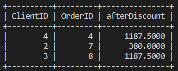

# Practicing with functions (Optional)

Mangata and Gallo (also called M&G) is a jewelry store specializing in special occasions like engagements, weddings and anniversaries. 

T​hey maintain all data about their jewelry store in a database named jewelrystore_db with 4 tables.
 
## Instructions: 

To complete this exercise, you can either keep the MySQL terminal open from the previous lab, or use MySQL on your own machine. To install MySQL on your own machine you can follow the instructions provided in the link in the additional resources item in the first module of this course.
     
###  Prerequisites   
Set up the database and the tables using the following SQL statements.

1. Create the database and the clients' table.
```SQL  
CREATE DATABASE jewelrystore_db; 

USE jewelrystore_db; 

CREATE TABLE clients 
(ClientID int NOT NULL, 
ClientName varchar(255) DEFAULT NULL, 
Address varchar(255) DEFAULT NULL, 
ContactNo varchar(10) DEFAULT NULL, 
PRIMARY KEY (ClientID));
```

2​. Create the client_orders table.
```SQL  
CREATE TABLE client_orders 
(OrderID INT NOT NULL, 
ClientID INT DEFAULT NULL, 
ItemID INT DEFAULT NULL, 
Cost INT DEFAULT NULL, 
PRIMARY KEY (OrderID));
```  

3​. Create the item table.
```SQL  
CREATE TABLE item 
(ItemID INT NOT NULL, 
Name varchar(150) DEFAULT NULL, 
Cost INT DEFAULT NULL, 
PRIMARY KEY (ItemID));
```  

4. Create the mg_orders table
```SQL  
CREATE TABLE mg_orders 
(OrderID INT NOT NULL, 
ItemID INT DEFAULT NULL, 
Quantity INT DEFAULT NULL, 
Cost INT DEFAULT NULL, 
OrderDate DATE DEFAULT NULL, 
DeliveryDate DATE DEFAULT NULL, 
OrderStatus VARCHAR(50) DEFAULT NULL, 
PRIMARY KEY (OrderID));
```    

5. Populate the clients table with data.
```SQL  
INSERT INTO clients VALUES 
(1, 'Kishan Hughes','223 Golden Hills, North Austin, TX','387986345'), 
(2, 'Indira Moncada','119 Silver Street, Bouldin Creek, TX','334567243'), 
(3, 'Mosha Setsile','785 Bronze Lane, East Austin, TX','315642597'), 
(4, 'Laura Mills','908 Diamond Crescent, South Lamar, TX','300842509'), 
(5, 'Henrik Kreida','345, Golden Hills, North Austin, TX','358208983'), 
(6, 'Millicent Blou','812, Diamond Crescent, North Burnet, TX','347898755');
``` 

6. Populate the item table with data.
```SQL
INSERT INTO item VALUES 
(1,'Engagement ring',2500), 
(2,'Silver brooch',400), 
(3,'Earrings',350), 
(4,'Luxury watch',1250), 
(5,'Golden bracelet',800), 
(6,'Gemstone',1500); 
```

7​. Populate the client_orders table with data.
```SQL
INSERT INTO client_orders VALUES 
(1,1,1,2500), 
(2,2,2,400), 
(3,3,3,350), 
(4,4,4,1250), 
(5,5,5,800), 
(6,6,6,1500), 
(7,2,4,400), 
(8,3,4,1250), 
(9,4,2,400), 
(10,1,3,350);
```

8​. Populate the mg_orders table with data.
```SQL
INSERT INTO mg_orders VALUES 
(1,1,50,122000,'2022-04-05','2022-05-25', 'Delivered'), 
(2,2,75,28000,'2022-03-08',NULL, 'In progress'), 
(3,3,80,25000,'2022-05-19','2022-06-08', 'Delivered'), 
(4,4,45,100000,'2022-01-10',NULL, 'In progress'), 
(5,5,70,56000,'2022-05-19',NULL, 'In progress'), 
(6,6,60,90000,'2022-06-10','2022-06-18', 'Delivered');
```

## Tasks

**Task 1:** Use the MySQL CEIL function to express the cost after the discount in the form of the smallest integer as follows:

Give a 5% discount to the clients who have ordered luxury watches. Express the cost after the discount in the form of the smallest integer, which is not less than the value shown in the afterDiscount column in the result table given below. Use the MySQL CEIL function to do this.

The following query is written to determine the cost of each order after the discount is applied.
```SQL
SELECT ClientID, OrderID, (Cost -(Cost * 5 /100)) As afterDiscount FROM client_orders WHERE ItemID = 4;
```

The result is as follows:
  

Your task is to apply the MySQL CEIL function to this query to express the cost after the discount in the form of the smallest integer, which is not less than the afterDiscount value in the result above.

**Task 2:** Format the afterDiscount column value from the earlier result for 5% discount in '#,###,###.##' format rounded to 2 decimal places using the FORMAT function.

**Task 3:** Find the expected delivery dates for their orders. The scheduled delivery date is 30 days after the order date. Use the ADDDATE function.

**Task 4:** Generate data required for a report with details of all orders that have not yet been delivered. The DeliveryDate column has a NULL value for orders not yet delivered. It would help if you showed a value of 'NOT DELIVERED' instead of showing NULL for orders that are not yet delivered. Use the COALESCE function to do this.

**Task 5:** Generate data required for the report by retrieving a list of M&G orders yet to be delivered. These orders have an 'In Progress' status using the NULLIF function.
