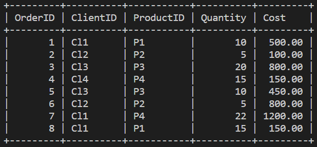
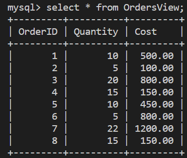
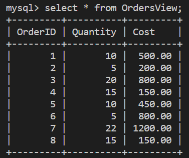

# Work with views in MySQL 

## Lab Instructions 
Lucky Shrub is a medium-sized garden design firm that sells indoor and outdoor plants, making them a one stop shop for clients.  In this lab, you must complete the following tasks to make it easier for Lucky Shrub staff to insert and update data in the Orders table using the MySQL REPLACE statement.    

The Orders table contains information about the Order ID, Client ID, Product ID, Quantity and Cost as shown in the following screenshot.   

  

**Note:** Before you begin, make sure you know how to access [MySQL environment](https://www.coursera.org/learn/database-structures-and-management-with-mysql/supplement/BSZK6/how-to-access-mysql-environment).

###  Prerequisites   
To complete this lab, you must have Lucky Shrub database created in MySQL. You must also have created and populated the Orders table with relevant data in the Lucky Shrub database.   

If you don't have access to this data, you can created the database and the Orders table using the following code.
  
1: Create database  
```SQL  
CREATE DATABASE Lucky_Shrub;  
```  

2: Use database  
```SQL  
USE Lucky_Shrub;  
```  

3: Create Orders table   
```SQL  
CREATE TABLE Orders (OrderID INT NOT NULL PRIMARY KEY, ClientID VARCHAR(10), ProductID VARCHAR(10), Quantity INT, Cost DECIMAL(6, 2));  
```  

4: Insert data  
```SQL  
INSERT INTO Orders (OrderID, ClientID, ProductID, Quantity, Cost) VALUES (1, "Cl1", "P1", 10, 500), (2, "Cl2", "P2", 5, 100), (3, "Cl3", "P3", 20, 800), (4, "Cl4", "P4", 15, 150), (5, "Cl3", "P3", 10, 450), (6, "Cl2", "P2", 5, 800), (7, "Cl1", "P4", 22, 1200), (8, "Cl1", "P1", 15, 150);   
```    

## The main objectives of this activity are as follows:     
1. Create a virtual table.
2. Update the base table using the virtual table.
3. Rename the virtual table.
4. Drop the virtual table.

## Exercise Instructions  
Please complete the following tasks.  

**Task 1:** Write a SQL statement to create the OrdersView Virtual table based on the Orders table. The table must include the following columns: Order ID, Quantity and Cost. Once you have executed the query, select all data from the OrdersView table. The expected output result should be the same as the following screenshot (assuming that you have created and populated the table correctly).  
  
 
**Task 2:** Write a SQL statement that utilizes the ‘OrdersView’ virtual table to Update the base Orders table. In the UPDATE TABLE statement, change the cost to 200 where the order id equals 2. Once you have executed the query, select all data from the OrdersView table. The expected output result should be the same as the following screenshot (assuming that you have created and populated the table correctly). 
  
 
**Task 3:** Write a SQL statement that changes the name of the ‘OrdersView’ virtual table to ClientsOrdersView. 

**Task 4:** Write a SQL statement to delete the Orders virtual table. 